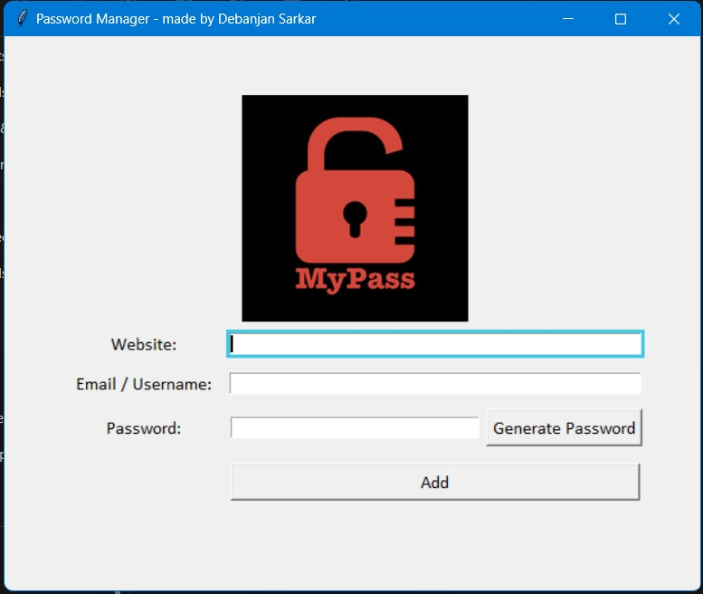
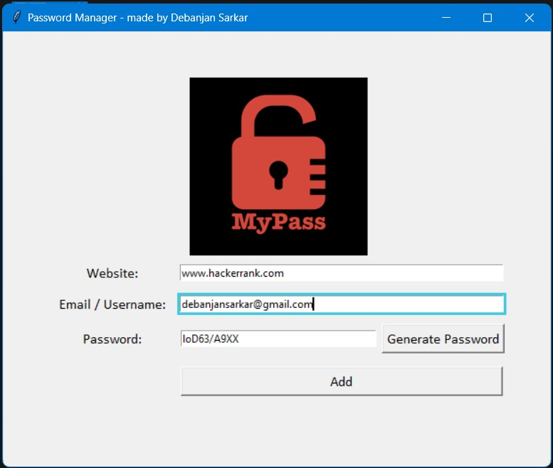
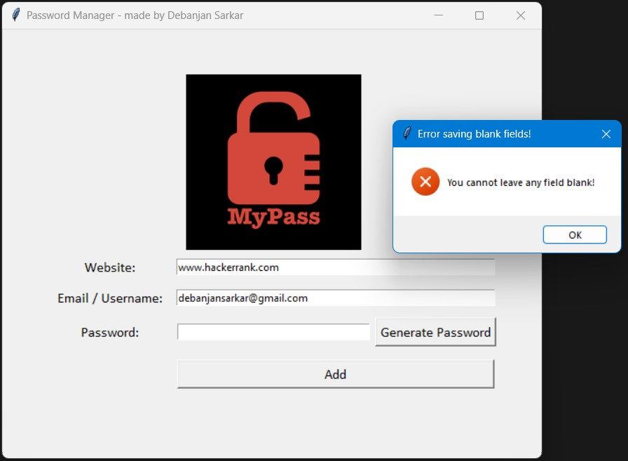
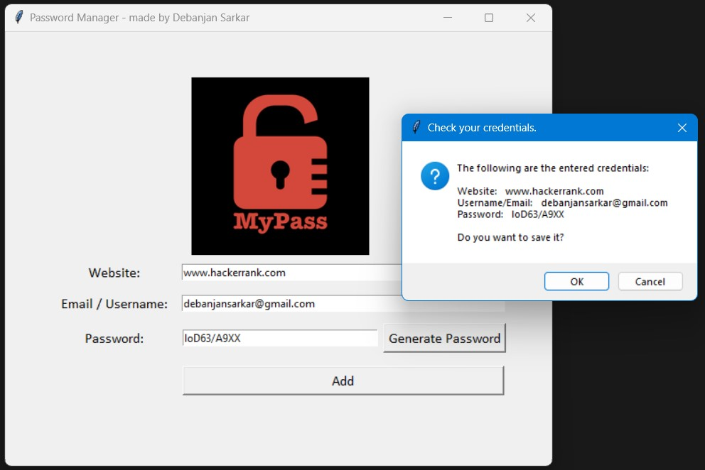
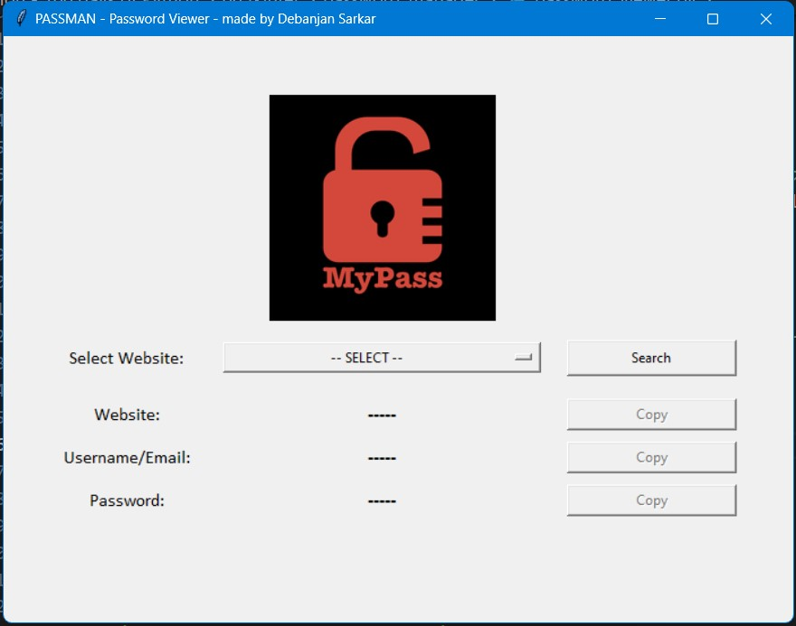
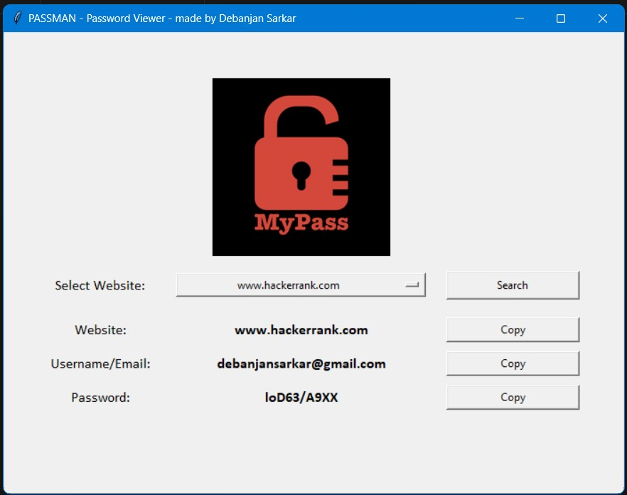

# PASSMAN - Your Personal Password Manager
--------------------------------------------

## Overview
----------------------------------------------------------------
This password manager is a GUI-program built using the Tkinter module in Python. It provides users with a convenient way to organize and manage their passwords securely, and retrieve them easily whenever required. The password manager stores all passwords locally in a CSV file, ensuring data security.
*Though it currently uses local storage to store passwords in a CSV file, it can be simply extended by writing custom functions, to use Encryption, and Database storage using custom functions and ORMs/connectors.*

## Features
----------------------------------------------------------------
- **Graphical User Interface (GUI):** The password manager features a user-friendly GUI built with Tkinter, making it easy to navigate and use. There are two GUI interfaces in it:
    - One to store the credentials.
    - Other to retrieve and view the stored credentials.
- **Password Generation:** Users can generate strong and secure passwords of random lengths between 10 to 20 characters.
- **Secure Password Storage:** All passwords are stored locally in a CSV file, ensuring data privacy and security.
- **Credential Validation:** Before saving credentials, the manager validates the input fields to ensure completeness and prevent errors.
- **Clipboard Copy:** After generating a password, the manager automatically copies it to the clipboard for easy pasting.
- **Error Handling:** The manager includes error handling mechanisms to alert users of incomplete or incorrect input.
- **Easy to Setup and Use:** Just clone the repository and run the password manager and password viewer script files - no environment setup required (I have already included the `pyperclip` python module in the project root directory such that it can be directly launched and used).
- **Light-weight:** The program is under 50kb, so is super-light, and dazzling fast to launch and use.
- **Password Viewer:** The stored passwords can be viewed using a dedicated GUI script, in which credentils can be search based on the website name, by simply selecting website from the list of stored websites, from a dropdown menu.

## Installation
----------------------------------------------------------------
1. Clone the repository on your machine's hard drive.
2. The application is ready to be used.

## Stepwise Usage
----------------------------------------------------------------

### Saving and Organising Credentials:

1. Launch the password manager by running the Python script named `password_manager_main.py`. Upon launch, the UI looks as follow:  

  

2. Fill in the required credential details in the following fields: Website, Email/Username, and Password.  
Optionally, use the "Generate Password" button to create a secure password, if you do not want to take the hassle of thinking unique passwords involving typical combination of letters, digits and symbols. Generate password can create passwords similar to the one shown below:  
  
When a password is generated using "Generate" button, it automatically gets copied to clipboard for direct usage.   

3. Click the "Add" button to save the credentials.  
If any of the fields are left empty while adding, it shows following warning message, and blocks the storage of credentials:  
   
After all the credentials are written, before saving, the program asks for final confimation:  
  
Upon clicking "OK", credentials will get saved. Click "Cancel" to correct any typos in your credentials.  
Passwords are stored locally in a CSV file for future reference, inside a directory named "creds", created inside the root folder.

### Viewing Saved Credentials:

1. After saving one or more credentials, to view them, launch the `password_viewer.py` script file. The UI looks as follows:  
   

2. Click on the dropdown menu to select the website whose credentials are to be fetched. List of the websites for which stored credentials exists, appear in the dropdown menu.

3. Click on the `Search` button, to get the credentials for the selected website. After clicking `Search`, the results in a way shown below:  
   

4. The results can be simply and easily copied using the dedicated buttons. This makes the use of the credentials very easy.

## Requirements
-----------------
- Python 3.10+ version
- Tkinter module (comes with standard Python installation)
- Pyperclip module (optional - provided with the project for easy setup and usage)

## Author
------------------
**Debanjan Sarkar** 
<a href="https://www.linkedin.com/in/debanjan-sarkar-2001/" target="_blank">LinkedIn</a> 
<a href="https://github.com/DebanjanSarkar" target="_blank">Github</a> 
<a href="https://twitter.com/darkolexis" target="_blank">Twitter (X)</a>  
Feel free to explore, contribute, and enhance the PASSMAN Password Manager project! If you have any questions or suggestions, please don't hesitate to contact.